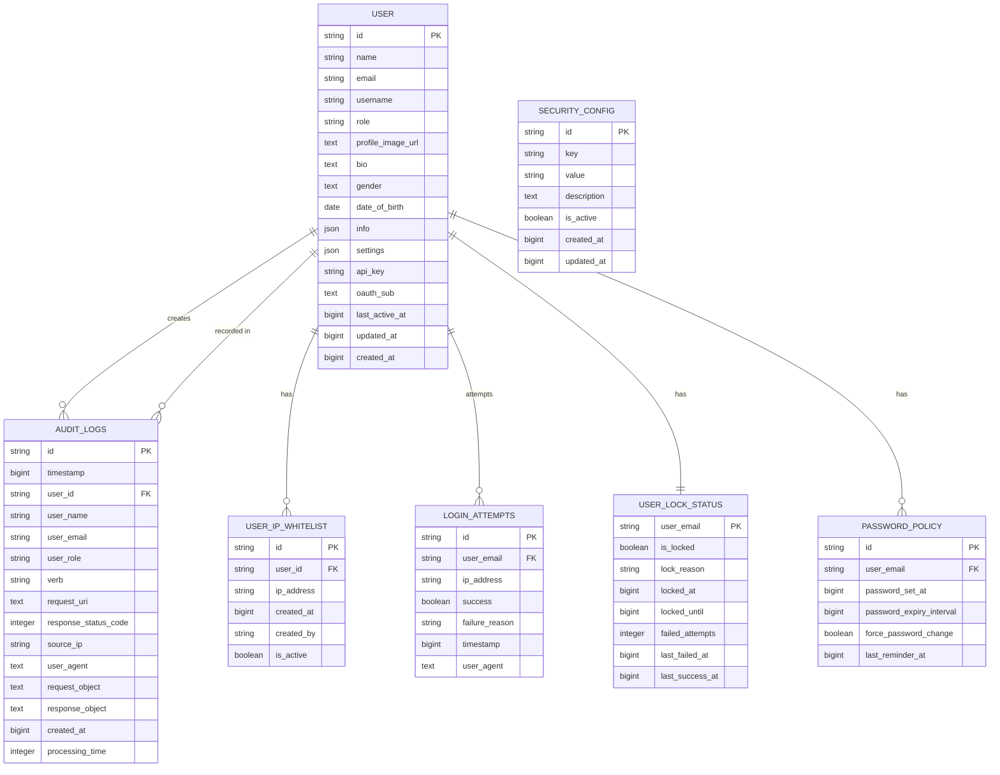

# ER Diagram

以下是对 Open WebUI 项目中审计日志和安全相关实体的关系图。

```mermaid
erDiagram
    %% 实体定义
    USER {
        string id PK
        string name
        string email
        string username
        string role
        text profile_image_url
        text bio
        text gender
        date date_of_birth
        json info
        json settings
        string api_key
        text oauth_sub
        bigint last_active_at
        bigint updated_at
        bigint created_at
    }

    AUDIT_LOGS {
        string id PK
        bigint timestamp
        string user_id FK
        string user_name
        string user_email
        string user_role
        string verb
        text request_uri
        integer response_status_code
        string source_ip
        text user_agent
        text request_object
        text response_object
        bigint created_at
        integer processing_time
    }

    USER_IP_WHITELIST {
        string id PK
        string user_id FK
        string ip_address
        bigint created_at
        string created_by
        boolean is_active
    }

    LOGIN_ATTEMPTS {
        string id PK
        string user_email FK
        string ip_address
        boolean success
        string failure_reason
        bigint timestamp
        text user_agent
    }

    USER_LOCK_STATUS {
        string user_email PK
        boolean is_locked
        string lock_reason
        bigint locked_at
        bigint locked_until
        integer failed_attempts
        bigint last_failed_at
        bigint last_success_at
    }

    PASSWORD_POLICY {
        string id PK
        string user_email FK
        bigint password_set_at
        bigint password_expiry_interval
        boolean force_password_change
        bigint last_reminder_at
    }

    SECURITY_CONFIG {
        string id PK
        string key
        string value
        text description
        boolean is_active
        bigint created_at
        bigint updated_at
    }

    %% 关系定义
    USER ||--o{ AUDIT_LOGS : creates
    USER ||--o{ USER_IP_WHITELIST : has
    USER ||--o{ LOGIN_ATTEMPTS : attempts
    USER ||--|| USER_LOCK_STATUS : has
    USER ||--o{ PASSWORD_POLICY : has
    USER ||--o{ AUDIT_LOGS : "recorded in"
```